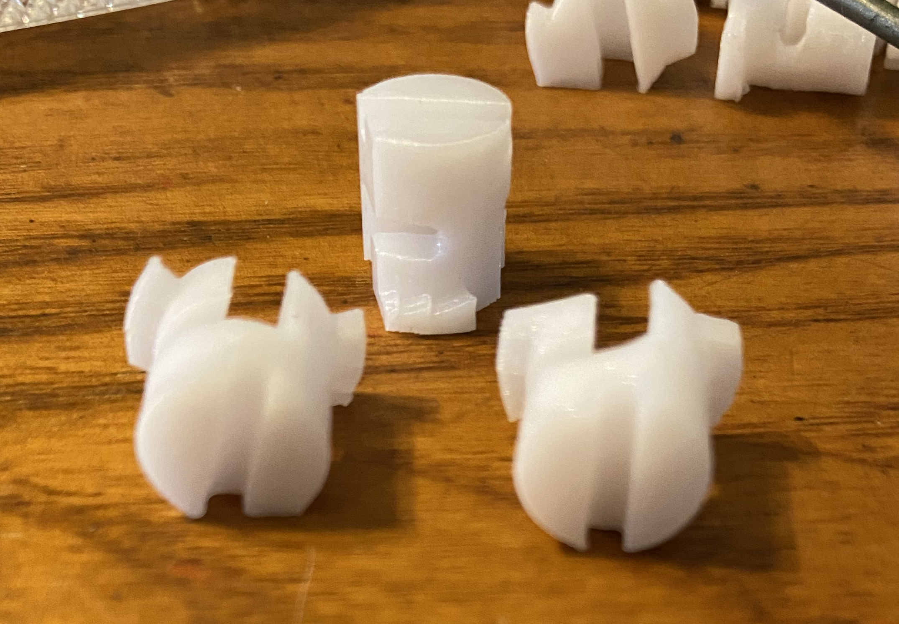
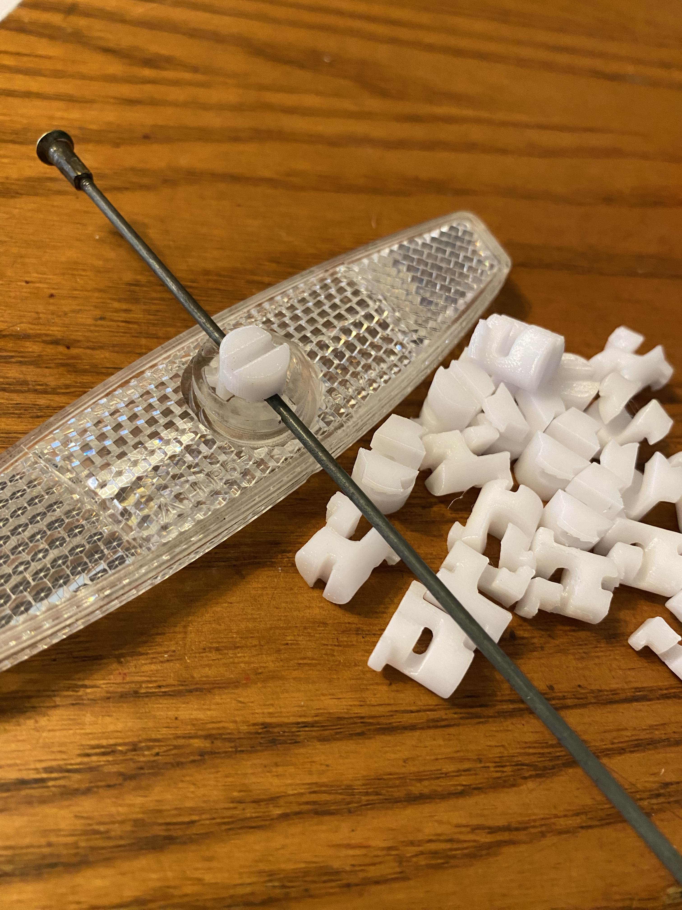
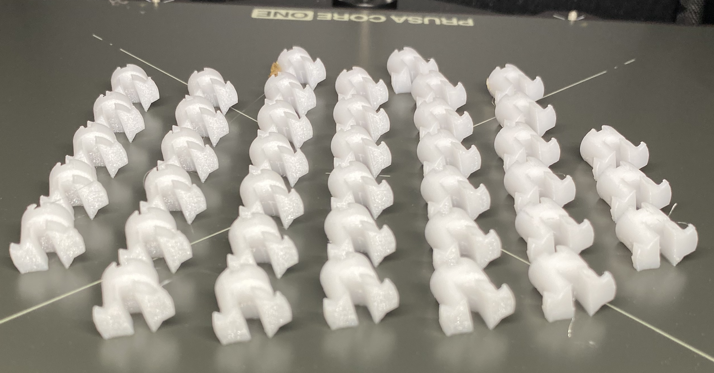

# Reflector Spoke Screw

Used on many modern bikes to hold wheel spoke reflectors onto a spoke.  The original part often breaks, or gets lost, this part is similar to the original but is modified to be printable without supports.

## Assembly instructions

> Note: Make sure to press in with screw driver before turning

Use replacement screw as you would the original screw but be careful as PETG might be more flexible than original making part more prone to bend.

## Print settings

- PETG Suggested
  - PLA was to brittle for me but some other material stiffer than PETG would be ideal
- Print flat side down
- 100% infill
- 4 perimeters
- 0.1mm layer height
- No supports

> Warning: Bed adhesion is low, I suggest using smooth print bed or adhesion helper.

## ReflectorSpokeScrew.scad

