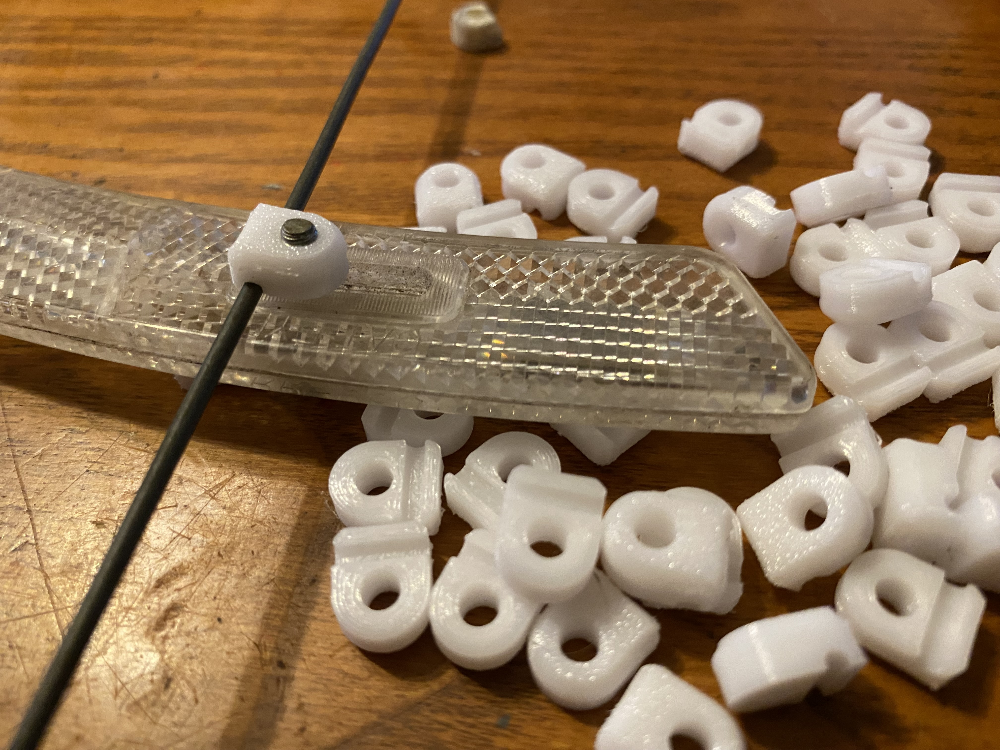
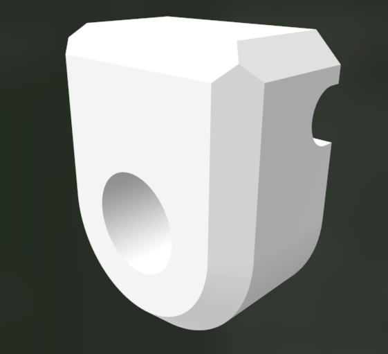

# Reflector Spoke Tab

Used on many older bikes to hold wheel spoke reflectors onto spokes.  The original part often breaks, this is a clone or the original part, best printed in PETG.

## Assembly instructions

> Note: Make sure grove in tab fits snugly around spoke be for assembly

Use replacement tab as you would the original tab but note that screw will thread into plastic on first use.

## Print settings

- PETG Suggested
- Print top side down
- 100% infill
- 4 perimeters
- 0.1mm layer height
- No Supports

## ReflectorSpokeTab.scad

