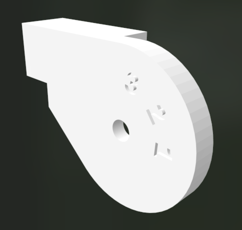

# Shimano 333 3-speed parts

Designs for 3d printable replacement parts for shimano 333 3 speed internal hub parts.

## Top Cover

The plastic top cover on the shifter is easily broken rendering the shifter non-functional.  In my experience the rest of the shifter remains functional, so a replacement top cover fixes the issue.

This part is designed to use 4mm shift housing with a plastic cable end inserted into the top cover.

This part is best printed in PETG but the example above is printed in PLA.

### Top Cover 1

This design more closely resembles the orignial but has a more robust cable housing area.

### Top Cover 2

This design has more plastic surrounding the cable housing area but no longer matches the oringal housings shape.

