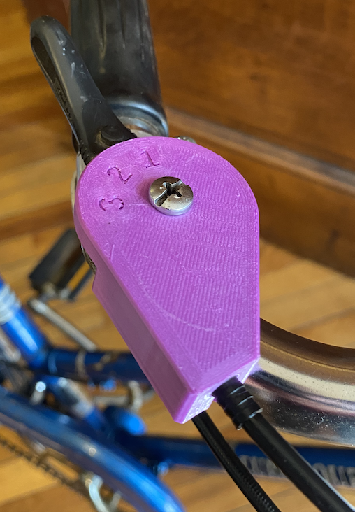
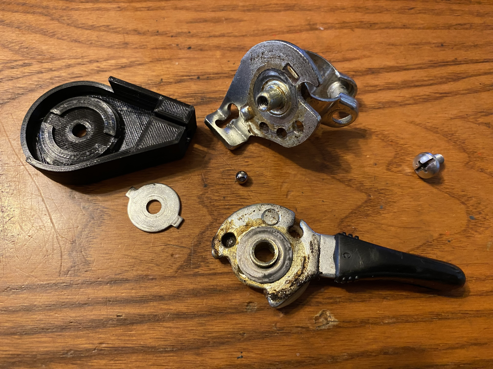

# Top Cover

The plastic top cover on the shifter is easily broken rendering the shifter non-functional.  The rest of the shifter generally remains functional, so a replacement top cover fixes the issue.

This part is designed to use either 4mm housing with a plastic cable end or a 5 mm housing with a metal end.  Reuse the screw, ball bearing and internal metal plate from the original shifter.

## Assembly instructions

Dissassemble the broken shifter keeping mind of the order of parts.  Swap the broken housing for the 3d printed one and reassemble.  Mind the ball bearing, it may be loose or missing.

> Note 1: Some models of this shifter have tabs on the top metal washer some do not, both models work with the new top cover.
> Note 2: Ball bearing is 3/16"
> Note 3: Apply grease to the moving assemblies if dry

## Print settings

- PETG suggested
- Print top side down
- 100% infill
- 4-6 perimeters
- 0.1mm layer height
- (Optional) Fuzzzy skin on outside walls and chamfers to hide print lines

## TopCover.scad

This design has more plastic surrounding the cable housing area than the original for increased strength.

