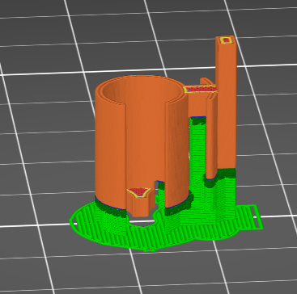

# SRAM S7 Alignment Sleeve

I didn't design this part so I will just link to post and describe how best to print it.  The part could be improved to have a longer tab so it is easier to remove from the click box but I did not attempt.

The STL can be found on [Thingiverse](https://www.thingiverse.com/thing:4240412)

## Print Settings

- PETG Suggested
- Print tab side down
- 100% infill
- 4 perimeters
- 0.1mm layer height
- Supports to Bed Only

